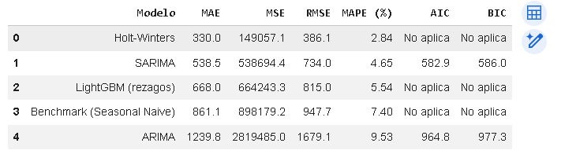
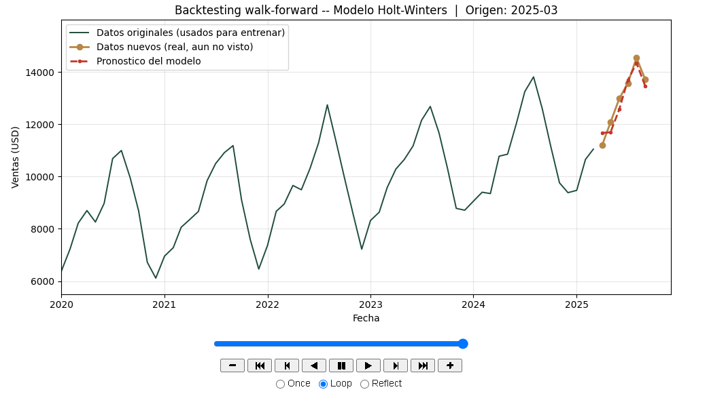
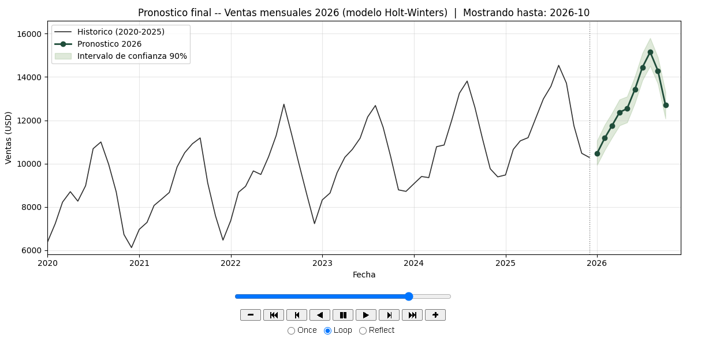

# 📈 Pronóstico de Ventas con Series de Tiempo — Distribuidora de Insumos Agrícolas

Proyecto final del curso de Series de Tiempo (Grow Up Data Analytics). El objetivo: seleccionar una serie de tiempo real de negocio, analizarla, comparar distintos modelos de pronóstico, evaluar cuál generaliza mejor y generar una recomendación accionable — no solo ejecutar código, sino demostrar razonamiento sobre lógica temporal aplicada a una decisión de negocio real.

## 🧠 La pregunta de negocio

> ¿Qué comportamiento se espera para las ventas mensuales de la distribuidora en los próximos períodos, y qué tan útil es ese pronóstico para tomar decisiones de inventario y dotación comercial?

**Contexto:** una distribuidora de insumos agrícolas (fertilizantes y bioestimulantes) con un negocio fuertemente estacional — picos de demanda en la temporada de aplicación en campo (junio–septiembre) y valles en fin/inicio de año (noviembre–febrero). Anticipar esa demanda impacta directamente en compras a proveedores, dimensionamiento de inventario y planificación del equipo comercial.

## 🗂️ Dataset

- **Serie:** ventas mensuales (USD)
- **Período:** enero 2020 – diciembre 2025 (72 meses)
- **Frecuencia:** mensual

## 🔎 Metodología

El proyecto sigue un flujo completo de forecasting de punta a punta:

1. **Selección y justificación de la serie** — por qué importa pronosticarla y qué decisión habilita.
2. **Preparación de datos** — fechas, duplicados, valores faltantes, outliers, frecuencia.
3. **Análisis exploratorio** — tendencia, estacionalidad, promedio móvil, descomposición, ACF/PACF, prueba de estacionariedad (ADF).
4. **Separación train/test respetando el orden temporal** (sin shuffling).
5. **Construcción y comparación de modelos.**
6. **Evaluación con métricas de error** (MAE, MSE, RMSE, MAPE, y AIC/BIC donde aplica).
7. **Pronóstico final** con intervalo de confianza.
8. **Conclusiones y recomendación de negocio.**

## 🤖 Modelos comparados

| Modelo | MAE | MSE | RMSE | MAPE (%) | AIC | BIC |
|---|---|---|---|---|---|---|
| **Holt-Winters** ⭐ | **330,0** | **149.057,1** | **386,1** | **2,84** | No aplica | No aplica |
| SARIMA | 538,5 | 538.694,4 | 734,0 | 4,65 | 582,9 | 586,0 |
| LightGBM (rezagos) | 668,0 | 664.243,3 | 815,0 | 5,54 | No aplica | No aplica |
| Benchmark (Seasonal Naive) | 861,1 | 898.179,0 | 947,7 | 7,40 | No aplica | No aplica |
| ARIMA | 1.239,8 | 2.819.485,0 | 1.679,0 | 9,53 | 964,8 | 977,3 |

**¿Por qué ganó Holt-Winters?** No fue solo por tener el menor error: mantuvo un error estable a lo largo de todo el horizonte de prueba, es simple e interpretable (nivel + tendencia + estacionalidad), y tiene sentido para la lógica real del negocio — una lección clave del proyecto es que el modelo más sofisticado (SARIMA, LightGBM) no siempre generaliza mejor que uno simple cuando la serie es corta y el patrón estacional es muy regular.

## 📊 Visualizaciones interactivas

Este proyecto no se queda en gráficos estáticos — incluye dos piezas interactivas pensadas para explorar el resultado, no solo mirarlo:

**1. Backtesting walk-forward animado**
Simula cómo se hubiera comportado el modelo "en producción": en varios puntos del pasado, se entrena solo con los datos disponibles hasta ese momento, se pronostican los siguientes 6 meses, y se compara contra lo que realmente ocurrió — con controles de play/pausa/loop para recorrer cada punto en el tiempo.

**2. Pronóstico final interactivo**
Histórico + proyección 2026 + intervalo de confianza del 90%, con zoom, hover y range slider.

> 💡 Para reproducir la interactividad real (no solo la imagen), corré el notebook en Google Colab o Jupyter — el HTML/JS queda embebido en las celdas.

## ✅ Recomendación de negocio

- Preparar inventario adicional de cara a la temporada alta (junio–septiembre 2026), anticipando un crecimiento de aprox. 4-5% respecto al mismo período de 2025.
- Reforzar el equipo comercial y logístico antes de junio, ya que el modelo anticipa una aceleración de la demanda desde mayo.
- Planificar con más holgura noviembre–febrero, el período de menor actividad del año.
- Monitorear mes a mes el valor real contra el pronosticado, prestando especial atención en los meses más lejanos del horizonte (donde el intervalo de confianza es más amplio).

## ⚠️ Limitaciones

- Se entrenó con 6 años de historial (72 meses); un historial más largo probablemente mejoraría la estimación de tendencia y estacionalidad.
- El modelo asume que el futuro se comporta como el pasado — no incorpora clima, competencia, regulación agrícola ni shocks económicos.
- Es una proyección probable, no una garantía: debe usarse como apoyo a la decisión junto con el juicio del equipo de negocio.

## 🛠️ Tecnologías

`Python` · `pandas` · `statsmodels` (Holt-Winters, ARIMA/SARIMA) · `pmdarima` · `LightGBM` · `Plotly` · `Matplotlib` · `Jupyter / Google Colab`

## ▶️ Cómo correrlo

1. Abrí el notebook en [Google Colab](https://colab.research.google.com/) o Jupyter local.
2. Corré la primera celda para instalar dependencias (`pmdarima`, `lightgbm`, `plotly`).
3. Ejecutá las celdas en orden — el notebook está documentado paso a paso siguiendo la metodología de arriba.

## 👤 Autor

**Héctor Díaz** — Analista / Consultor de Business Intelligence
[LinkedIn](https://www.linkedin.com/in/hector-diaz) · [agregar enlace real]
